# Sushi Palermo

* Live project: [Sushi Palermo Live Project](https://alhogarty.github.io/CI_PP1_SP/)

* Github repository: [Sushi Palermo Github repository](https://github.com/AlHogarty/CI_PP1_SP)

## Table of Contents

## Project Aims
### User 
* 
### Site Owner
* 
### User Stories

#### First-time User
1. As a first time user, I want to be able to easily navigate through the site
2. As a first time user, I want to to see where the restaurant is located
3. As a first time user, I want to read about the restaurant
4. As a first time user, I want to find out what is on the menu
5. As a first time user, I want to see images of the restaurant

#### Returning User
6. As a returning user, I want to see the price range of the menu
7. As a returning user, I want to see the opening times of the restaurant
8. As a returning user, I want to read reviews of the restaurant
9. As a returning user, I want to be able to make a reservation
10. As a returning user, I want to find the social media links for the restaurant

#### Site Owner
11. As the site owner, I want the users to get to know the restaurant
12. As the site owner, I want the users to find the address of the restaurant
13. As the site owner, I want the users to be able to book a table
14. As the site owner, I want the users to watch the video about how sushi is made
15. As the site owner, I want the users to be able to view a different main image on each page

## Design

### Color

A white background, black font colors were used accross the site. Red hover links were used on the social media links. Originally the red active links were used, but that was causeing contrast issues. A grey backgroud with white text was used on the reservations form and review section.

### Fonts

* Signika Negative
* Montserrat

### Wireframes

Home

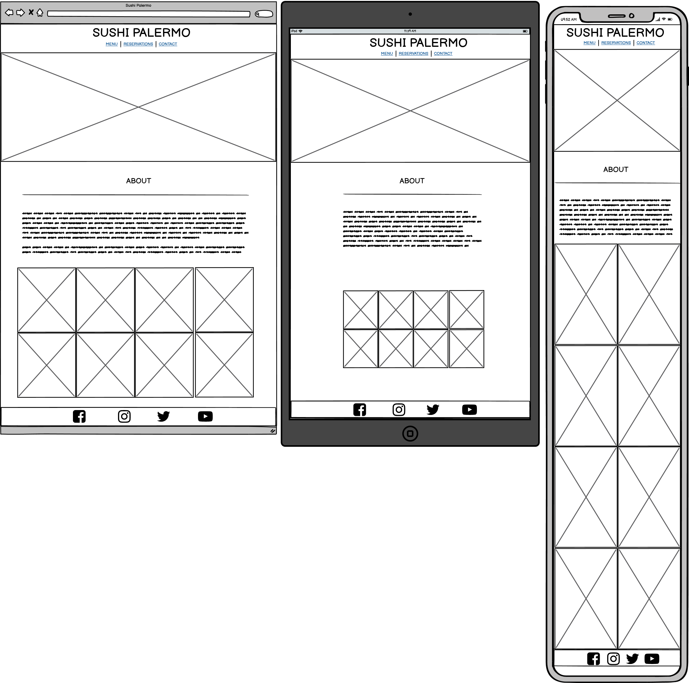

Menu

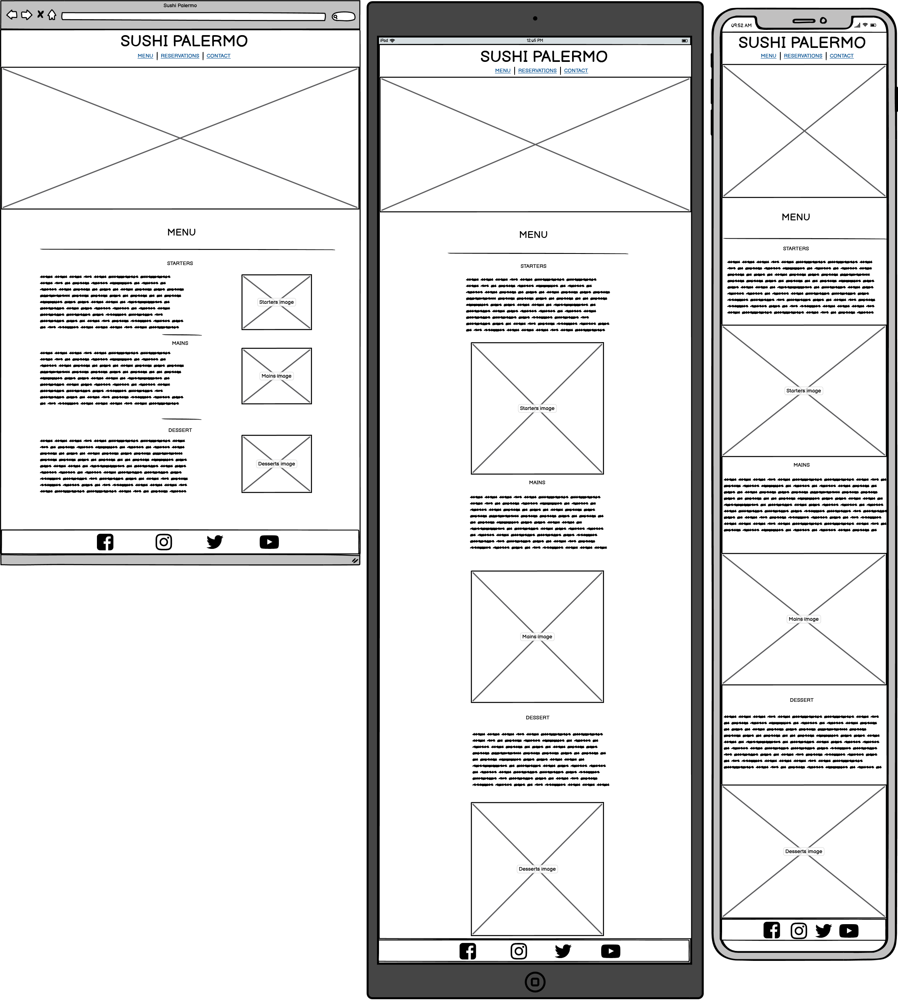

Reservations

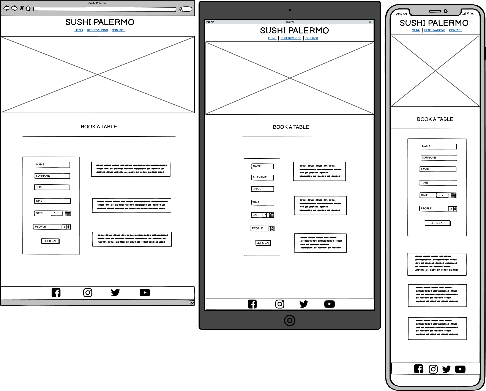

Contact

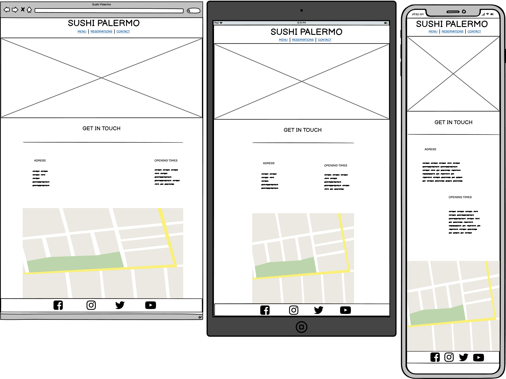

## Features of the Site
### Logo

* The logo for Sushi Palermo is used accross all pages and serves as a link to the index.html, which is also the about section 
### Navigation

* The navigation section is used accross all pages of the site and is used to navigate to the various sections of the site
### Main Image

* The main image consists of four different images that are used accross the site to give each page a different feel
### Content Section
* The content section is unique to every page and has the about section, menu section, reservations section and contact section
### Footer Social Media Links

* The footer social media links are located at the bottom of each page accross all pages and consist of four icons for facebook, instagram, twitter and youtube

## Page Content
### Home Page

* The home page is the first page that the user will see and it also serves as the about section which will show the user the a brief introduction of the restraurant including a external youtube video on how to make sushi and 12 images below
### Menu Page

* The menu page shows the user what is on the menu of the restaurant and consists of starters, mains and desserts. Each one of these sections has 4 dishes with a brief description and price
### Reservations Page

* The reservations page shows the user a form that they can use to book a table for the restaurant. The user will be asked to enter their first and last name, email address, time and date of booking and how many people want to eat. Customer reviews have also been included on this page
### Contact Page

* The contact page shows the user contact information and consists of the address, opening times and a google maps iframe

## Technologies Used
### Languages
* HTML5 to provide structure and content
* CSS3 to provide style 
### Tools
* Font Awesome used for social media links
* Google Fonts used for all fonts accross the site
* Gitpod to create and edit the site
* Github to host files and deployment of site

## Resources
* Code Institute course materials, tutor and mentor support
* W3schools 
* Love Running Walkthrough
* Love Running Form Structure
* Code Institute Slack Community
* Pexels.com images:
(Satoshi Hirayama, Sebastian Coman, Janko Ferlic, Alessandro Avilés Renaldi, Cottonbro, Cup of Couple, Luiz Fernando Maciel, Natan Machado Fotografia)
* [Sushi Making Video](https://youtu.be/joweUxpHaqc) on about section

## Testing

### HTML Validation
The W3C Markup Validation Service was used to validate the HTML of the website. All pages pass with 0 errors.

Home

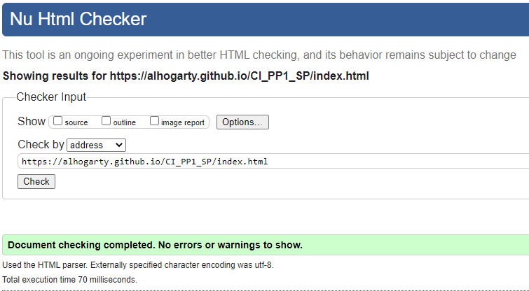

Menu

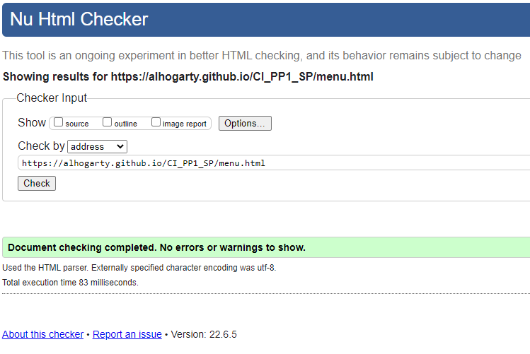

Reservations

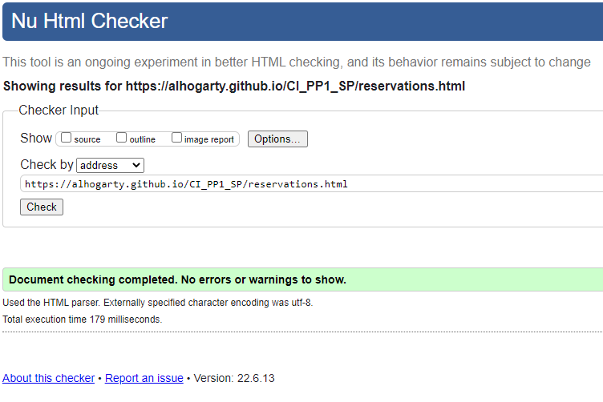

Contact

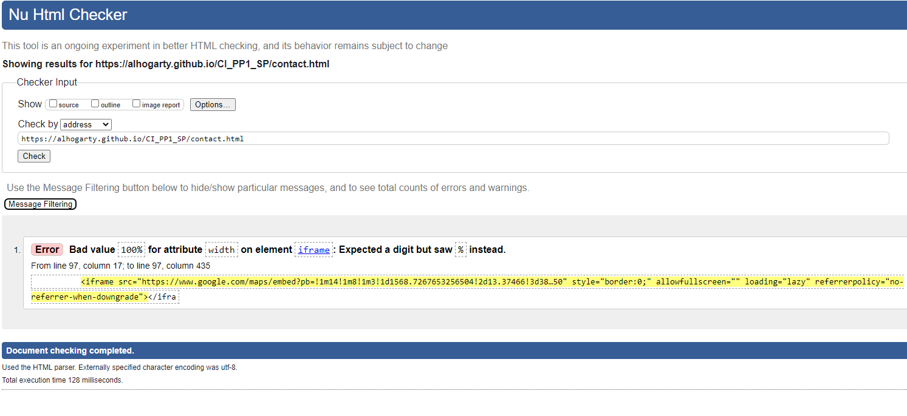

### CSS Validation
The W3C CSS Validation Service was used to validate the CSS of the website. All pages pass with 0 errors.

Whole Page

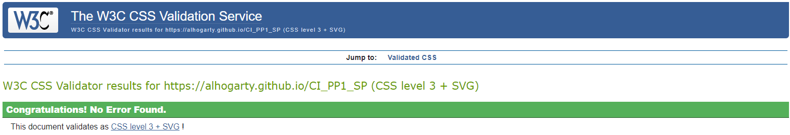

Stylesheet

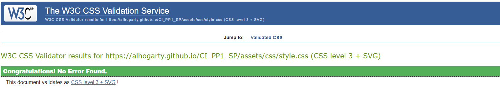

### Accessibility
The WAVE WebAIM web accessibility evaluation tool was used to ensure the website met high accessibility standards. All pages pass with 0 errors.

Home

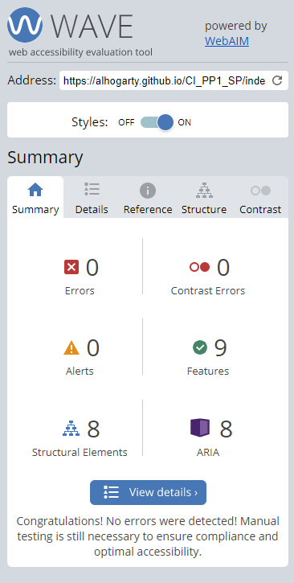

Menu

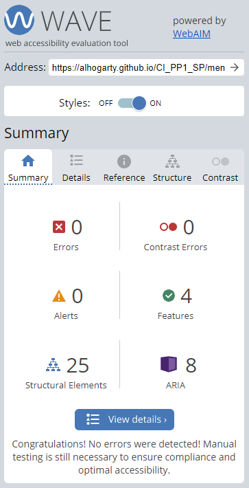

Reservations

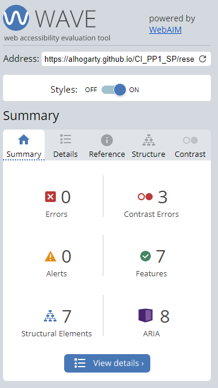

Contact

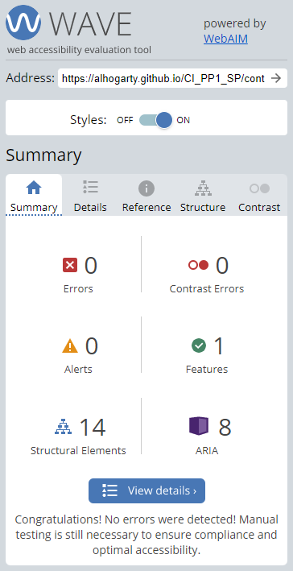

### Performance
Google Lighthouse was used to measure the performance and speed of the website. The entire site scored a high score, except for the menu.html page, which scored 88 for performance.

Home

Menu

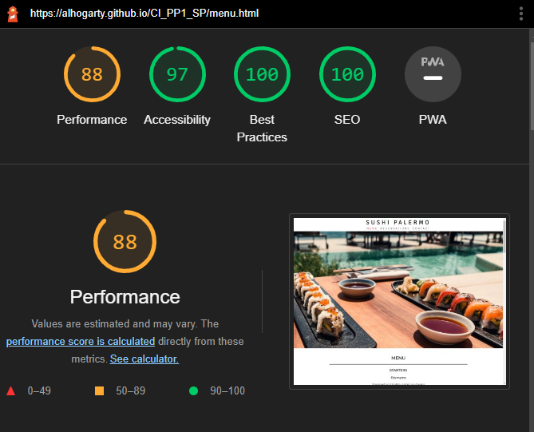

Reservations

Contact

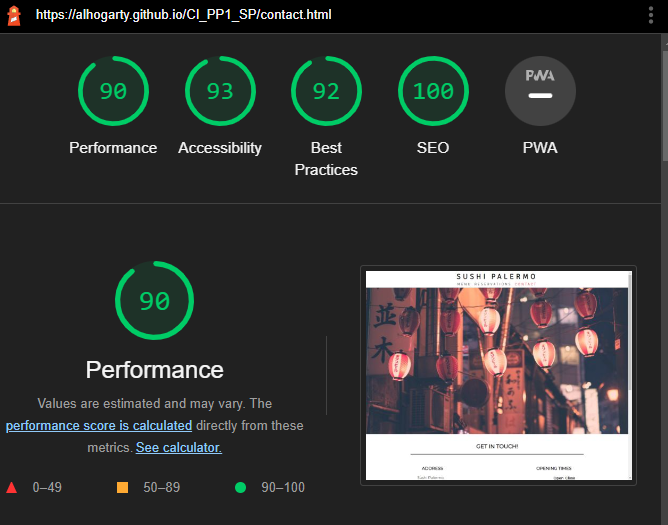

### Browser Testing
* Safari Mobile
* Google Chrome
* Firefox 

### Responsiveness
* Google Dev Tools

## Acknowledegments
* To my family and friends for their testing, feedback and support
* To my mentor Mo Shami for his guidance, feedback and support
* To the Code Institute Slack community for their advice, resources and support

