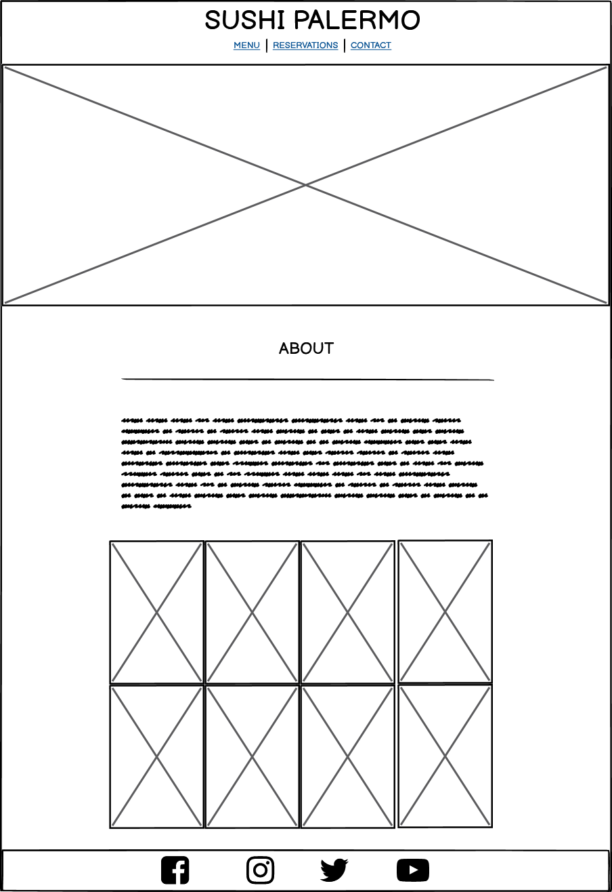
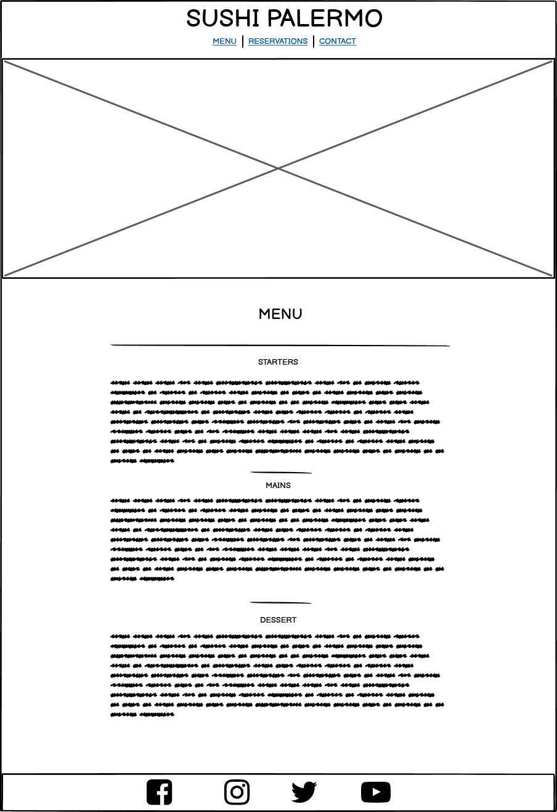
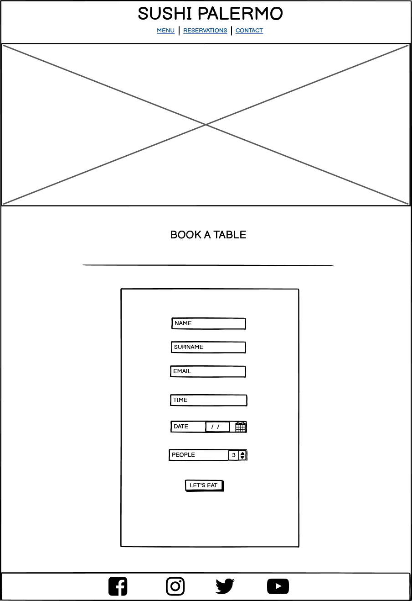
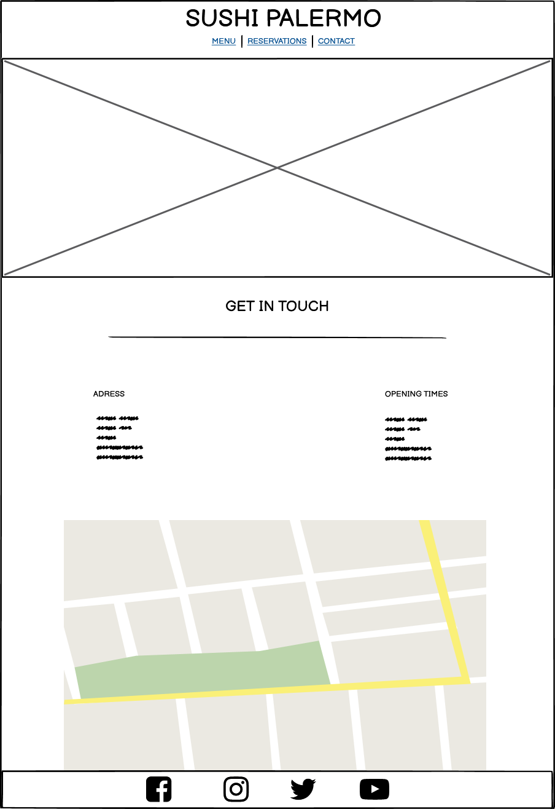

# Sushi Palermo

* Live project located here: [Sushi Palermo](https://www.google.com)

* Link to Github repository is: [Sushi Palermo](https://github.com/AlHogarty/CI_PP1_SP)

## Table of Contents

1. [Project Aims](#project-aims)
    1. [Business Type](#business-type)
    2. [Target Audience](#target-audience)
    3. [User Stories](#user-stories)
2. [Features of the Site](#features-of-the-site)
    1. [Logo](#logo)
    2. [Navigation](#navigation)
    3. [Main Image](#main-image)
    4. [Content Section](#content-section)
    5. [Footer Social Media Links](#footer-social-media-links)
3. [Page Content](#page-content)
    1. [Home Page](#home-page)
    2. [Menu Page](#menu-page)
    3. [Reservations Page](#reservations-page)
    4. [Contact Page](#contact-page)
4. [Wireframes](#wireframes)
5. [Technologies Used](#technologies-used)
    1. [Languages](#Languages)
    2. [Tools](#tools)
6. [Testing](#testing)
    1. [Browser Testing](#browser-testing)
    2. [Validator](#validator)
    3. [Responsiveness](#responsiveness)
7. [Acknowledegments](#acknowledegments)

## Project Aims
### Business Type
* Restaurant specialising in Japanese food in the heart of Sicily
### Target Audience
* Families who are looking for something different in Palermo
* Businesses that are looking to book corporate events
* Tourists who are in need of some sushi in Sicily
### User Stories
* User wants to be able to easily navigate through the website
* User wants to be able to read the history of the restaurant on the about page
* User wants to have a look at the menu items, descriptions and prices of all the meals
* User wants to book a table in the reservations page
* User wants to find out the address, opening times and location on the contact page

## Features of the Site
### Logo

* The logo for Sushi Palermo is used accross all pages and serves as a link to the index.html, which is also the about section 
### Navigation

* The navigation section is used accross all pages of the site and is used to navigate to the various sections of the site
### Main Image

* The main image consists of four different images that are used accross the site to give each page a different feel
### Content Section
* The content section is unique to every page and has the about section, menu section, reservations section and contact section
### Footer Social Media Links

* the footer social media links are located at the bottom of each page accross all pages and consist of four icons for facebook, instagram, twitter and youtube

## Page Content
### Home Page

* The home page is the first page that the user will see and it also serves as the about section which will show the user the a brief introduction of the restraurant including 12 images below
### Menu Page

* The menu page shows the user what is on the menu of the restaurant and consists of starters, mains and desserts. Each one of these sections has 4 dishes with a brief description and price
### Reservations Page

* The reservations page shows the user a form that they can use to book a table for the restaurant. The user will be asked to enter their first and last name, email address, time and date of booking and how many people want to eat.
### Contact Page

* The contact page shows the user contact information and consists of the address, opening times and a google maps iframe

## Wireframes

Home

Menu

Reservations

Contact

## Technologies Used
### Languages
* HTML5 to provide structure and content
* CSS3 to provide style 
### Tools
* Font Awesome used for social media links
* Google Fonts used for all fonts accross the site
* Gitpod to create and edit the site
* Github to host files and deployment of site

## Resources
* Code Institute course materials, tutor and mentor support
* W3schools 
* Love Running Walkthrough
* Love Running Form Structure
* Code Institute Slack Community
* Pexels.com images:
(Satoshi Hirayama, Sebastian Coman, Janko Ferlic, Alessandro Avilés Renaldi, Cottonbro, Cup of Couple, Luiz Fernando Maciel, Natan Machado Fotografia)

## Testing

### Browser Testing
* Safari Mobile
* Google Chrome
* Firefox 
### Validator
* https://validator.w3.org/
### Responsiveness
* Google Dev Tools

## Acknowledegments

