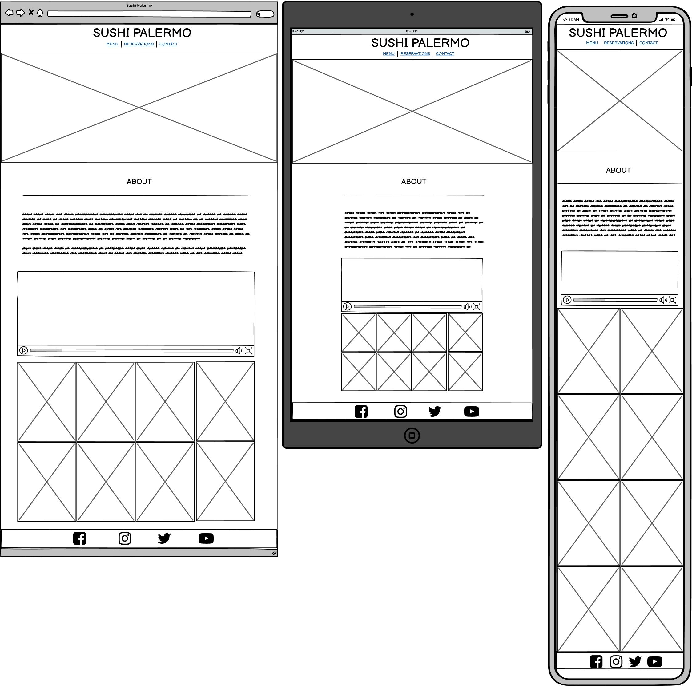
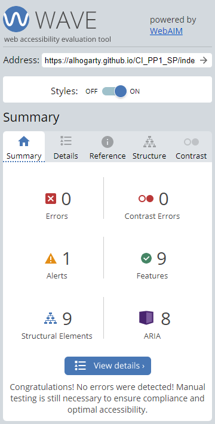

# Sushi Palermo

* Live project: [Sushi Palermo Live Project](https://alhogarty.github.io/CI_PP1_SP/)

* Github repository: [Sushi Palermo Github repository](https://github.com/AlHogarty/CI_PP1_SP)

## Table of Contents

## Project Aims
### User 
* 
### Site Owner
* 
### User Stories

#### First-time User
1. As a first time user, I want to be able to easily navigate through the site
2. As a first time user, I want to to see where the restaurant is located
3. As a first time user, I want to read about the restaurant
4. As a first time user, I want to find out what is on the menu
5. As a first time user, I want to see images of the restaurant

#### Returning User
6. As a returning user, I want to see the price range of the menu
7. As a returning user, I want to see the opening times of the restaurant
8. As a returning user, I want to read reviews of the restaurant
9. As a returning user, I want to be able to make a reservation
10. As a returning user, I want to find the social media links for the restaurant

#### Site Owner
11. As the site owner, I want the users to get to know the restaurant
12. As the site owner, I want the users to find the address of the restaurant
13. As the site owner, I want the users to be able to book a table
14. As the site owner, I want the users to watch the video about how sushi is made
15. As the site owner, I want the users to be able to view a different main image on each page

## Design

### Color

A white background, black font colors were used accross the site. Red hover links were used on the social media links. Originally the red active links were used, but that was causeing contrast issues. A grey backgroud with white text was used on the reservations form and review section.

### Fonts

* Signika Negative
* Montserrat

### Wireframes

Home

Menu

Reservations

Contact

## Technologies Used
### Languages
* HTML5 to provide structure and content
* CSS3 to provide style 
### Tools
* Font Awesome used for social media links
* Google Fonts used for all fonts accross the site
* Gitpod to create and edit the site
* Github to host files and deployment of site

## Features of the Site
### Logo

* The logo for Sushi Palermo is used accross all pages and serves as a link to the index.html, which is also the about section
* User stories covered: 1
### Navigation

* The navigation section is used accross all pages of the site and is used to navigate to the various sections of the site
* User stories covered: 1
### 404 Page

* If the user gets lost and ends up on a page that doesn't exist, they will be directed to the 404 page where they can easily navigate back to the main page
* User stories covered: 1
### Map

* The map is located in the contact page and lets the user know the location of the retaurant on google maps
* User stories covered: 2, 12
### Address

* The address is located in the contact page and lets the user find out the address
* User stories covered: 2, 12
### Story to the Restaurant

* The story of the restaurant is located in the about section and gives the user an introdution to the restaurant
* User stories covered: 3, 11
### Food Menu

* The menu tells the user what food is on the menu
* User stories covered: 4
### Images of the Restaurant

* The images of the restaurant are located in the about section and gives the user an idea of how it looks inside
* User stories covered: 5

### Prices

* The prices are included within the food menu and tells the user the price
range
* User stories covered: 6
### Opening Times

* The opening times is located in the contact page and lets the user know when the restaurant is open
* User stories covered: 7
### Customer Reviews

* The reviews are located in the reservations page and lets the user read reviews
* User stories covered: 8
### Reservation Form

* The form is located in the reservations page and lets the user book a table
* User stories covered: 9, 13
### Footer Social Media Links

* The footer social media links are located at the bottom of each page accross all pages and consist of four icons for facebook, instagram, twitter and youtube
* User stories covered: 10
### Sushi Making Video

* The video tells the user how sushi is made
* User stories covered: 11, 14
### Main Image

* The main image consists of four different images that are used accross the site to give each page a different look
* User stories covered: 15

## Resources
* Code Institute course materials, tutor and mentor support
* W3schools 
* Love Running Walkthrough
* Love Running Form Structure
* Code Institute Slack Community
* Pexels.com images:
(Satoshi Hirayama, Sebastian Coman, Janko Ferlic, Alessandro Avilés Renaldi, Cottonbro, Cup of Couple, Luiz Fernando Maciel, Natan Machado Fotografia)
* [Sushi Making Video](https://youtu.be/joweUxpHaqc) on about section

## Testing

### HTML Validation
The W3C Markup Validation Service was used to validate the HTML of the website. All pages pass with 0 errors.

Home

Menu

Reservations

Contact

### CSS Validation
The W3C CSS Validation Service was used to validate the CSS of the website. All pages pass with 0 errors.

Whole Page

Stylesheet

### Accessibility
The WAVE WebAIM web accessibility evaluation tool was used to ensure the website met high accessibility standards. All pages pass with 0 errors.

Home

Menu

Reservations

Contact

### Performance
Google Lighthouse was used to measure the performance and speed of the website. The entire site scored a high score, except for the menu.html page, which scored 88 for performance.

Home

Menu

Reservations

Contact

### Browser Compatibility
The website was tested on the following browers:
* Safari Mobile
* Google Chrome
* Firefox 

### Testing User Stories

### Responsiveness
* Google Dev Tools

## Acknowledegments
* To my family and friends for their testing, feedback and support
* To my mentor Mo Shami for his guidance, feedback and support
* To the Code Institute Slack community for their advice, resources and support

