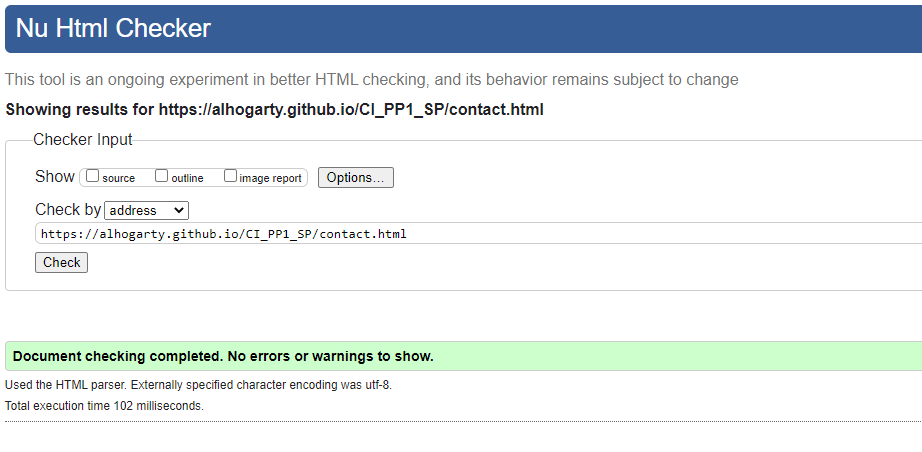
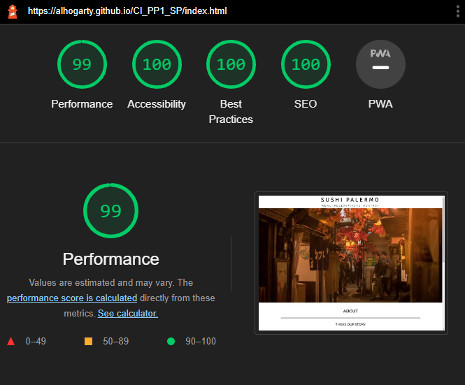
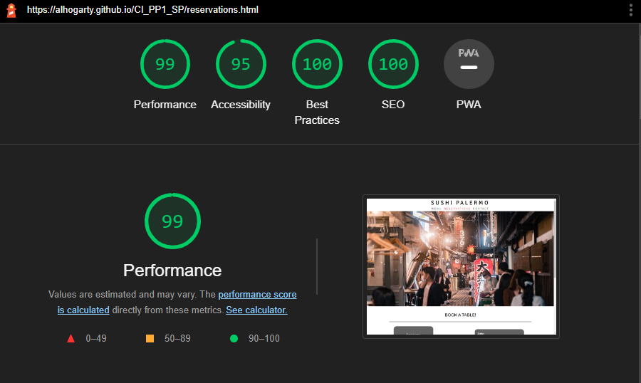

# Sushi Palermo

* Live project: [Sushi Palermo Live Project](https://alhogarty.github.io/CI_PP1_SP/)

* Github repository: [Sushi Palermo Github repository](https://github.com/AlHogarty/CI_PP1_SP)

## Table of Contents

1. [Project Aims](#project-aims)
    1. [Business Type](#business-type)
    2. [Target Audience](#target-audience)
    3. [User Stories](#user-stories)
2. [Features of the Site](#features-of-the-site)
    1. [Logo](#logo)
    2. [Navigation](#navigation)
    3. [Main Image](#main-image)
    4. [Content Section](#content-section)
    5. [Footer Social Media Links](#footer-social-media-links)
3. [Page Content](#page-content)
    1. [Home Page](#home-page)
    2. [Menu Page](#menu-page)
    3. [Reservations Page](#reservations-page)
    4. [Contact Page](#contact-page)
4. [Design](#design)
    1. [Color](#color)
    2. [Fonts](#fonts)
    3. [Wireframes](#wireframes)
5. [Technologies Used](#technologies-used)
    1. [Languages](#Languages)
    2. [Tools](#tools)
6. [Testing](#testing)
    1. [HTML Validation](#html-validation)
    2. [CSS Validation](#css-validation)
    3. [Accessibility](#accessibility)
    4. [Performance](#performance)
    5. [Browser Testing](#browser-testing)
    6. [Responsiveness](#responsiveness)
7. [Acknowledegments](#acknowledegments)

## Project Aims
### Business Type
* Restaurant specialising in Japanese food in the heart of Sicily
### Target Audience
* Families who are looking for something different in Palermo
* Businesses that are looking to book corporate events
* Tourists who are in need of some sushi in Sicily
### User Stories
* User wants to be able to easily navigate through the website
* User wants to be able to read the history of the restaurant on the about page
* User wants to be able to look at the menu items, images, descriptions and prices of all the meals
* User wants to book a table in the reservations page
* User wants to read customer reviews
* User wants to find out the address, opening times and location on the contact page

## Features of the Site
### Logo

* The logo for Sushi Palermo is used accross all pages and serves as a link to the index.html, which is also the about section 
### Navigation

* The navigation section is used accross all pages of the site and is used to navigate to the various sections of the site
### Main Image

* The main image consists of four different images that are used accross the site to give each page a different feel
### Content Section
* The content section is unique to every page and has the about section, menu section, reservations section and contact section
### Footer Social Media Links

* the footer social media links are located at the bottom of each page accross all pages and consist of four icons for facebook, instagram, twitter and youtube

## Page Content
### Home Page

* The home page is the first page that the user will see and it also serves as the about section which will show the user the a brief introduction of the restraurant including 12 images below
### Menu Page

* The menu page shows the user what is on the menu of the restaurant and consists of starters, mains and desserts. Each one of these sections has 4 dishes with a brief description and price
### Reservations Page

* The reservations page shows the user a form that they can use to book a table for the restaurant. The user will be asked to enter their first and last name, email address, time and date of booking and how many people want to eat. Customer reviews have also been included on this page
### Contact Page

* The contact page shows the user contact information and consists of the address, opening times and a google maps iframe

## Design

### Color

### Fonts

* Signika Negative
* Montserrat

### Wireframes

Home

Menu

Reservations

Contact

## Technologies Used
### Languages
* HTML5 to provide structure and content
* CSS3 to provide style 
### Tools
* Font Awesome used for social media links
* Google Fonts used for all fonts accross the site
* Gitpod to create and edit the site
* Github to host files and deployment of site

## Resources
* Code Institute course materials, tutor and mentor support
* W3schools 
* Love Running Walkthrough
* Love Running Form Structure
* Code Institute Slack Community
* Pexels.com images:
(Satoshi Hirayama, Sebastian Coman, Janko Ferlic, Alessandro Avilés Renaldi, Cottonbro, Cup of Couple, Luiz Fernando Maciel, Natan Machado Fotografia)

## Testing

### HTML Validation
The W3C Markup Validation Service was used to validate the HTML of the website. All pages pass with 0 errors. All pages but contact.html pass with 0 errors and 0 warnings.

Home

Menu

Reservations

Contact

### CSS Validation
The W3C CSS Validation Service was used to validate the CSS of the website. All pages pass with 0 errors

Whole Page

Stylesheet

### Accessibility
The WAVE WebAIM web accessibility evaluation tool was used to ensure the website met high accessibility standards. There were some contrast errors, because of the color red.

Home

Menu

Reservations

Contact

### Performance
Google Lighthouse was used to measure the performance and speed of the website. The entire site scored a high score, except for the menu.html page, which scored 88 for performance.

Home

Menu

Reservations

Contact

### Browser Testing
* Safari Mobile
* Google Chrome
* Firefox 

### Responsiveness
* Google Dev Tools

## Acknowledegments
* To my family and friends for their testing, feedback and support
* To my mentor Mo Shami for his guidance, feedback and support
* To the Code Institute Slack community for their advice, resources and support

